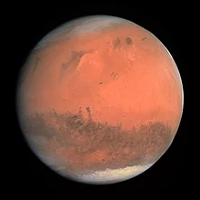

<table class="infobox"><caption class="fn org">Mars&nbsp;</caption>
<tbody>
<tr>
<td colspan="2">

Pictured in natural color in 2007

</td>
</tr>
<tr>
<th colspan="2">Designations</th>
</tr>
<tr>
<th scope="row">Pronunciation</th>
<td><a title="Help:IPA/English" href="https://en.wikipedia.org/wiki/Help:IPA/English">/ˈmɑːrz/</a>&nbsp;</td>
</tr>
<tr>
<th scope="row"><a title="List of adjectivals and demonyms of astronomical bodies" href="https://en.wikipedia.org/wiki/List_of_adjectivals_and_demonyms_of_astronomical_bodies">Adjectives</a></th>
<td><a title="Martian" href="https://en.wikipedia.org/wiki/Martian">Martian</a>&nbsp;<a title="Help:IPA/English" href="https://en.wikipedia.org/wiki/Help:IPA/English">/ˈmɑːrʃən/</a></td>
</tr>
<tr>
<th colspan="2"><a title="Osculating orbit" href="https://en.wikipedia.org/wiki/Osculating_orbit">Orbital characteristics</a></th>
</tr>
<tr>
<td colspan="2"><a title="Epoch (astronomy)" href="https://en.wikipedia.org/wiki/Epoch_(astronomy)">Epoch</a>&nbsp;<a class="mw-redirect" title="J2000" href="https://en.wikipedia.org/wiki/J2000">J2000</a></td>
</tr>
<tr>
<th scope="row"><a class="mw-redirect" title="Perihelion and aphelion" href="https://en.wikipedia.org/wiki/Perihelion_and_aphelion">Aphelion</a></th>
<td>249200000&nbsp;km <small>(154800000&nbsp;mi; 1.666&nbsp;AU)</small></td>
</tr>
<tr>
<th scope="row"><a class="mw-redirect" title="Perihelion and aphelion" href="https://en.wikipedia.org/wiki/Perihelion_and_aphelion">Perihelion</a></th>
<td>206700000&nbsp;km <small>(128400000&nbsp;mi; 1.382&nbsp;AU)</small></td>
</tr>
<tr>
<th scope="row">

<a title="Semi-major and semi-minor axes" href="https://en.wikipedia.org/wiki/Semi-major_and_semi-minor_axes">Semi-major axis</a>

</th>
<td>227939200&nbsp;km <small>(141634900&nbsp;mi;&nbsp;1.523679&nbsp;AU)</small></td>
</tr>
<tr>
<th scope="row"><a title="Orbital eccentricity" href="https://en.wikipedia.org/wiki/Orbital_eccentricity">Eccentricity</a></th>
<td>0.0934</td>
</tr>
<tr>
<th scope="row">

<a title="Orbital period" href="https://en.wikipedia.org/wiki/Orbital_period">Orbital period</a>

</th>
<td>686.971&nbsp;d <small>(1.88082&nbsp;<a class="mw-redirect" title="Annum" href="https://en.wikipedia.org/wiki/Annum">yr</a>;&nbsp;668.5991&nbsp;<a title="Timekeeping on Mars" href="https://en.wikipedia.org/wiki/Timekeeping_on_Mars">sols</a>)</small></td>
</tr>
<tr>
<th scope="row">

<a title="Orbital period" href="https://en.wikipedia.org/wiki/Orbital_period">Synodic period</a>

</th>
<td>779.96&nbsp;d <small>(2.1354&nbsp;<a class="mw-redirect" title="Annum" href="https://en.wikipedia.org/wiki/Annum">yr</a>)</small></td>
</tr>
<tr>
<th scope="row">

Average&nbsp;<a title="Orbital speed" href="https://en.wikipedia.org/wiki/Orbital_speed">orbital speed</a>

</th>
<td>24.007&nbsp;km/s <small>(86430&nbsp;km/h;&nbsp;53700&nbsp;mph)</small></td>
</tr>
<tr>
<th scope="row">

<a title="Mean anomaly" href="https://en.wikipedia.org/wiki/Mean_anomaly">Mean anomaly</a>

</th>
<td>19.412&deg;</td>
</tr>
<tr>
<th scope="row"><a title="Orbital inclination" href="https://en.wikipedia.org/wiki/Orbital_inclination">Inclination</a></th>
<td>

<ul>
<li>1.850&deg;&nbsp;to&nbsp;<a title="Ecliptic" href="https://en.wikipedia.org/wiki/Ecliptic">ecliptic</a>;</li>
<li>5.65&deg;&nbsp;the&nbsp;<a title="Sun" href="https://en.wikipedia.org/wiki/Sun">Sun</a>'s&nbsp;<a title="Equator" href="https://en.wikipedia.org/wiki/Equator">equator</a>;</li>
<li>1.67&deg;&nbsp;to&nbsp;<a title="Invariable plane" href="https://en.wikipedia.org/wiki/Invariable_plane">invariable plane</a></li>
</ul>

</td>
</tr>
<tr>
<th scope="row">

<a title="Longitude of the ascending node" href="https://en.wikipedia.org/wiki/Longitude_of_the_ascending_node">Longitude&nbsp;of ascending&nbsp;node</a>

</th>
<td>49.558&deg;</td>
</tr>
<tr>
<th scope="row">

<a title="Argument of periapsis" href="https://en.wikipedia.org/wiki/Argument_of_periapsis">Argument&nbsp;of perihelion</a>

</th>
<td>286.502&deg;</td>
</tr>
<tr>
<th scope="row"><a title="Natural satellite" href="https://en.wikipedia.org/wiki/Natural_satellite">Satellites</a></th>
<td><a title="Moons of Mars" href="https://en.wikipedia.org/wiki/Moons_of_Mars">2</a></td>
</tr>
<tr>
<th colspan="2">Physical characteristics</th>
</tr>
<tr>
<th scope="row">

Mean radius

</th>
<td>3389.5&nbsp;&plusmn;&nbsp;0.2&nbsp;km <small>(2106.1&nbsp;&plusmn;&nbsp;0.1&nbsp;mi)</small></td>
</tr>
<tr>
<th scope="row">

<a title="Equator" href="https://en.wikipedia.org/wiki/Equator">Equatorial</a>&nbsp;radius

</th>
<td>3396.2&nbsp;&plusmn;&nbsp;0.1&nbsp;km <small>(2110.3&nbsp;&plusmn;&nbsp;0.1&nbsp;mi; 0.533 Earths)</small></td>
</tr>
<tr>
<th scope="row">

<a title="Geographical pole" href="https://en.wikipedia.org/wiki/Geographical_pole">Polar</a>&nbsp;radius

</th>
<td>3376.2&nbsp;&plusmn;&nbsp;0.1&nbsp;km <small>(2097.9&nbsp;&plusmn;&nbsp;0.1&nbsp;mi; 0.531 Earths)</small></td>
</tr>
<tr>
<th scope="row"><a title="Flattening" href="https://en.wikipedia.org/wiki/Flattening">Flattening</a></th>
<td>0.00589&plusmn;0.00015</td>
</tr>
<tr>
<th scope="row">

<a title="Spheroid" href="https://en.wikipedia.org/wiki/Spheroid#Surface_area">Surface area</a>

</th>
<td>144798500&nbsp;km2 <small>(55907000&nbsp;sq&nbsp;mi; 0.284 Earths)</small></td>
</tr>
<tr>
<th scope="row"><a title="Volume" href="https://en.wikipedia.org/wiki/Volume">Volume</a></th>
<td>1.6318&times;1011&nbsp;km3 <small>(0.151 Earths)</small></td>
</tr>
<tr>
<th scope="row"><a title="Mass" href="https://en.wikipedia.org/wiki/Mass">Mass</a></th>
<td>6.4171&times;1023&nbsp;kg <small>(0.107 Earths)</small></td>
</tr>
<tr>
<th scope="row">

Mean&nbsp;<a title="Density" href="https://en.wikipedia.org/wiki/Density">density</a>

</th>
<td>3.9335&nbsp;g/cm3 <small>(0.1421&nbsp;lb/cu&nbsp;in)</small></td>
</tr>
<tr>
<th scope="row">

<a title="Surface gravity" href="https://en.wikipedia.org/wiki/Surface_gravity">Surface gravity</a>

</th>
<td>3.72076&nbsp;m/s2 <small>(12.2072&nbsp;ft/s2; 0.3794&nbsp;<em><a title="G-force" href="https://en.wikipedia.org/wiki/G-force">g</a></em>)</small></td>
</tr>
<tr>
<th scope="row">

<a title="Moment of inertia factor" href="https://en.wikipedia.org/wiki/Moment_of_inertia_factor">Moment of inertia factor</a>

</th>
<td>0.3662&plusmn;0.0017</td>
</tr>
<tr>
<th scope="row">

<a title="Escape velocity" href="https://en.wikipedia.org/wiki/Escape_velocity">Escape velocity</a>

</th>
<td>5.027&nbsp;km/s <small>(18100&nbsp;km/h;&nbsp;11250&nbsp;mph)</small></td>
</tr>
<tr>
<th scope="row">

Sidereal&nbsp;<a title="Rotation period" href="https://en.wikipedia.org/wiki/Rotation_period">rotation period</a>

</th>
<td>1.025957&nbsp;d &nbsp;24h&nbsp;37m&nbsp;22s</td>
</tr>
<tr>
<th scope="row">

Equatorial rotation&nbsp;velocity

</th>
<td>241.17&nbsp;m/s <small>(868.22&nbsp;km/h; 539.49&nbsp;mph)</small></td>
</tr>
<tr>
<th scope="row">

<a title="Axial tilt" href="https://en.wikipedia.org/wiki/Axial_tilt">Axial tilt</a>

</th>
<td>25.19&deg;&nbsp;to its orbital plane</td>
</tr>
<tr>
<th scope="row">

North&nbsp;pole&nbsp;<a title="Right ascension" href="https://en.wikipedia.org/wiki/Right_ascension">right ascension</a>

</th>
<td>317.68143&deg; &nbsp;21h&nbsp;10m&nbsp;44s</td>
</tr>
<tr>
<th scope="row">

North&nbsp;pole&nbsp;<a title="Declination" href="https://en.wikipedia.org/wiki/Declination">declination</a>

</th>
<td>52.88650&deg;</td>
</tr>
<tr>
<th scope="row"><a title="Albedo" href="https://en.wikipedia.org/wiki/Albedo">Albedo</a></th>
<td>

<ul>
<li>0.170&nbsp;<a title="Geometric albedo" href="https://en.wikipedia.org/wiki/Geometric_albedo">geometric</a></li>
<li>0.25&nbsp;<a title="Bond albedo" href="https://en.wikipedia.org/wiki/Bond_albedo">Bond</a></li>
</ul>

</td>
</tr>
<tr>
<td colspan="2">
<table>
<tbody>
<tr>
<th>Surface&nbsp;<a title="Temperature" href="https://en.wikipedia.org/wiki/Temperature">temp.</a></th>
<th>min</th>
<th>mean</th>
<th>max</th>
</tr>
<tr>
<th><a title="Kelvin" href="https://en.wikipedia.org/wiki/Kelvin">Kelvin</a></th>
<td>130&nbsp;K</td>
<td>210&nbsp;K</td>
<td>308&nbsp;K</td>
</tr>
<tr>
<th><a title="Celsius" href="https://en.wikipedia.org/wiki/Celsius">Celsius</a></th>
<td>&minus;143&nbsp;&deg;C</td>
<td>&minus;63&nbsp;&deg;C</td>
<td>35&nbsp;&deg;C</td>
</tr>
<tr>
<th><a title="Fahrenheit" href="https://en.wikipedia.org/wiki/Fahrenheit">Fahrenheit</a></th>
<td>&minus;226&nbsp;&deg;F</td>
<td>&minus;82&nbsp;&deg;F</td>
<td>95&nbsp;&deg;F</td>
</tr>
</tbody>
</table>
</td>
</tr>
<tr>
<th scope="row">

<a title="Apparent magnitude" href="https://en.wikipedia.org/wiki/Apparent_magnitude">Apparent magnitude</a>

</th>
<td>&minus;2.94 to +1.86</td>
</tr>
<tr>
<th scope="row">

<a title="Angular diameter" href="https://en.wikipedia.org/wiki/Angular_diameter">Angular diameter</a>

</th>
<td>3.5&ndash;25.1"</td>
</tr>
<tr>
<th colspan="2">Atmosphere</th>
</tr>
<tr>
<th scope="row">

Surface&nbsp;<a title="Atmospheric pressure" href="https://en.wikipedia.org/wiki/Atmospheric_pressure">pressure</a>

</th>
<td>0.636 (0.4&ndash;0.87)&nbsp;<a title="Pascal (unit)" href="https://en.wikipedia.org/wiki/Pascal_(unit)">kPa</a> 0.00628&nbsp;<a class="mw-redirect" title="Atmosphere (unit)" href="https://en.wikipedia.org/wiki/Atmosphere_(unit)">atm</a></td>
</tr>
<tr>
<th scope="row"><a title="Atmospheric chemistry" href="https://en.wikipedia.org/wiki/Atmospheric_chemistry#Atmospheric_composition">Composition by volume</a></th>
<td>

<ul>
<li>95.97%&nbsp;<a title="Carbon dioxide" href="https://en.wikipedia.org/wiki/Carbon_dioxide">carbon dioxide</a></li>
<li>1.93%&nbsp;<a title="Argon" href="https://en.wikipedia.org/wiki/Argon">argon</a></li>
<li>1.89%&nbsp;<a title="Nitrogen" href="https://en.wikipedia.org/wiki/Nitrogen">nitrogen</a></li>
<li>0.146%&nbsp;<a title="Oxygen" href="https://en.wikipedia.org/wiki/Oxygen">oxygen</a></li>
<li>0.0557%&nbsp;<a title="Carbon monoxide" href="https://en.wikipedia.org/wiki/Carbon_monoxide">carbon monoxide</a></li>
<li>0.0210%&nbsp;<a title="Water vapor" href="https://en.wikipedia.org/wiki/Water_vapor">water vapor</a></li>
<li>0.0100%&nbsp;<a title="Nitrogen oxide" href="https://en.wikipedia.org/wiki/Nitrogen_oxide">nitrogen oxide</a></li>
<li>0.00025%&nbsp;<a title="Neon" href="https://en.wikipedia.org/wiki/Neon">neon</a></li>
<li>0.00008%&nbsp;<a title="Semiheavy water" href="https://en.wikipedia.org/wiki/Semiheavy_water">hydrogen deuterium oxide</a></li>
<li>0.00003%&nbsp;<a title="Krypton" href="https://en.wikipedia.org/wiki/Krypton">krypton</a></li>
<li>0.00001%&nbsp;<a title="Xenon" href="https://en.wikipedia.org/wiki/Xenon">xenon</a></li>
</ul>

</td>
</tr>
</tbody>
</table>

 
<h2> Books </h2>
 

<ul>

                             

 <li><a target="_blank" href="https://github.com/manjunath5496/Books-about-Mars/blob/master/mars(1).pdf" style="text-decoration:none;">The Surface of Mars</a></li>

 <li><a target="_blank" href="https://github.com/manjunath5496/Books-about-Mars/blob/master/mars(2).pdf" style="text-decoration:none;">Exploring
Chemical Analysis </a></li>

<li><a target="_blank" href="https://github.com/manjunath5496/Books-about-Mars/blob/master/mars(3).pdf" style="text-decoration:none;">Planet Mars: Story of Another World</a></li>
 <li><a target="_blank" href="https://github.com/manjunath5496/Books-about-Mars/blob/master/mars(4).pdf" style="text-decoration:none;">Mars: Prospective Energy and Material Resources</a></li>                              
<li><a target="_blank" href="https://github.com/manjunath5496/Books-about-Mars/blob/master/mars(5).pdf" style="text-decoration:none;">Dust in the Atmosphere of Mars and Its Impact on the Human Exploration of Mars</a></li>
<li><a target="_blank" href="https://github.com/manjunath5496/Books-about-Mars/blob/master/mars(6).pdf" style="text-decoration:none;">Mars One: Humanity's Next Great Adventure - Inside the First Human Settlement on Mars</a></li>
 <li><a target="_blank" href="https://github.com/manjunath5496/Books-about-Mars/blob/master/mars(7).pdf" style="text-decoration:none;">Next Stop Mars: The Why, How, and When of Human Missions</a></li>

 <li><a target="_blank" href="https://github.com/manjunath5496/Books-about-Mars/blob/master/mars(8).pdf" style="text-decoration:none;">Mars Spaceship (All About Mars)</a></li>
   <li><a target="_blank" href="https://github.com/manjunath5496/Books-about-Mars/blob/master/mars(9).pdf" style="text-decoration:none;">The Geology of Mars: Evidence from Earth-Based Analogs</a></li>
  
   
 <li><a target="_blank" href="https://github.com/manjunath5496/Books-about-Mars/blob/master/mars(10).pdf" style="text-decoration:none;">Mars via the Moon: The Next Giant Leap</a></li>                              
<li><a target="_blank" href="https://github.com/manjunath5496/Books-about-Mars/blob/master/mars(11).pdf" style="text-decoration:none;"> Human Missions to Mars: Enabling Technologies for Exploring the Red Planet</a></li>
<li><a target="_blank" href="https://github.com/manjunath5496/Books-about-Mars/blob/master/mars(12).pdf" style="text-decoration:none;">To Mars and Beyond, Fast! How Plasma Propulsion Will Revolutionize Space Exploration</a></li>
<li><a target="_blank" href="https://github.com/manjunath5496/Books-about-Mars/blob/master/mars(13).pdf" style="text-decoration:none;">Exploration and Engineering:
The Jet Propulsion Laboratory and the Quest for Mars</a></li>

<li><a target="_blank" href="https://github.com/manjunath5496/Books-about-Mars/blob/master/mars(14).pdf" style="text-decoration:none;">Preventing the Forward Contamination of Mars</a></li>
                              
<li><a target="_blank" href="https://github.com/manjunath5496/Books-about-Mars/blob/master/mars(15).pdf" style="text-decoration:none;">Destination Mars: new explorations of the Red Planet</a></li>

<li><a target="_blank" href="https://github.com/manjunath5496/Books-about-Mars/blob/master/mars(16).pdf" style="text-decoration:none;">Curiosity: An Inside Look at the Mars Rover Mission and the People Who Made It Happen</a></li>

  <li><a target="_blank" href="https://github.com/manjunath5496/Books-about-Mars/blob/master/mars(17).pdf" style="text-decoration:none;">Mission to Mars: My Vision for Space Exploration</a></li>   
  
<li><a target="_blank" href="https://github.com/manjunath5496/Books-about-Mars/blob/master/mars(18).pdf" style="text-decoration:none;">Exploring Mars</a></li> 

  
<li><a target="_blank" href="https://github.com/manjunath5496/Books-about-Mars/blob/master/mars(19).pdf" style="text-decoration:none;">Mars: An Introduction to Its Interior, Surface and Atmosphere</a></li> 

<li><a target="_blank" href="https://github.com/manjunath5496/Books-about-Mars/blob/master/mars(20).pdf" style="text-decoration:none;">Ancient Aliens on Mars</a></li>

<li><a target="_blank" href="https://github.com/manjunath5496/Books-about-Mars/blob/master/mars(21).pdf" style="text-decoration:none;">The Case for Mars: The Plan to Settle the Red Planet and Why We Must</a></li>
<li><a target="_blank" href="https://github.com/manjunath5496/Books-about-Mars/blob/master/mars(22).pdf" style="text-decoration:none;">An Astrobiology Strategy for the Exploration of Mars</a></li> 
 <li><a target="_blank" href="https://github.com/manjunath5496/Books-about-Mars/blob/master/mars(23).pdf" style="text-decoration:none;">TIME a Year in Space: Inside Scott Kelly's Historic Mission - Is Travel to Mars Next?</a></li> 
 

   <li><a target="_blank" href="https://github.com/manjunath5496/Books-about-Mars/blob/master/mars(24).pdf" style="text-decoration:none;">Mars Underground</a></li>

<li><a target="_blank" href="https://github.com/manjunath5496/Books-about-Mars/blob/master/mars(25).pdf" style="text-decoration:none;">The Future of Humanity: Terraforming Mars, Interstellar Travel, Immortality, and Our Destiny Beyond Earth</a></li> 

<li><a target="_blank" href="https://github.com/manjunath5496/Books-about-Mars/blob/master/mars(26).pdf" style="text-decoration:none;">Elon Musk: How the Billionaire CEO of SpaceX and Tesla is Shaping our Future</a></li>

<li><a target="_blank" href="https://github.com/manjunath5496/Books-about-Mars/blob/master/mars(27).pdf" style="text-decoration:none;">An Anthropologist On Mars: Seven Paradoxical Tales</a></li>
<li><a target="_blank" href="https://github.com/manjunath5496/Books-about-Mars/blob/master/mars(28).pdf" style="text-decoration:none;">Use of Extraterrestrial
Resources for Human Space Missions to Moon or Mars</a></li> 
 <li><a target="_blank" href="https://github.com/manjunath5496/Books-about-Mars/blob/master/mars(29).pdf" style="text-decoration:none;">The Mars Mystery</a></li> 
 

   <li><a target="_blank" href="https://github.com/manjunath5496/Books-about-Mars/blob/master/mars(30).pdf" style="text-decoration:none;">Orbiting Ray
Bradbury's Mars: Biographical, Anthropological, Literary, Scientific and Other Perspectives</a></li>

<li><a target="_blank" href="https://github.com/manjunath5496/Books-about-Mars/blob/master/mars(31).pdf" style="text-decoration:none;">Mars Rover Curiosity: An Inside Account from Curiosity's Chief Engineer</a></li> 

<li><a target="_blank" href="https://github.com/manjunath5496/Books-about-Mars/blob/master/mars(32).pdf" style="text-decoration:none;">Human Exploration of Mars: The Reference Mission of the NASA Mars Exploration Study Team</a></li>

<li><a target="_blank" href="https://github.com/manjunath5496/Books-about-Mars/blob/master/mars(33).pdf" style="text-decoration:none;">Camille Flammarion's The Planet Mars</a></li> 

<li><a target="_blank" href="https://github.com/manjunath5496/Books-about-Mars/blob/master/mars(34).pdf" style="text-decoration:none;">The International Atlas of Mars Exploration: The First Five Decades: Volume 1: 1953 to 2003</a></li>

<li><a target="_blank" href="https://github.com/manjunath5496/Books-about-Mars/blob/master/mars(35).pdf" style="text-decoration:none;">Wind as a geological process
on Earth, Mars, Venus and Titan</a></li>

<li><a target="_blank" href="https://github.com/manjunath5496/Books-about-Mars/blob/master/mars(36).pdf" style="text-decoration:none;">Geographies of Mars
</a></li>

<li><a target="_blank" href="https://github.com/manjunath5496/Books-about-Mars/blob/master/mars(37).pdf" style="text-decoration:none;">Why Mars: NASA and the Politics of Space Exploration</a></li>

<li><a target="_blank" href="https://github.com/manjunath5496/Books-about-Mars/blob/master/mars(38).pdf" style="text-decoration:none;">Exploring Mars: Chronicles from a Decade of Discovery</a></li> 

<li><a target="_blank" href="https://github.com/manjunath5496/Books-about-Mars/blob/master/mars(39).pdf" style="text-decoration:none;">The NASA Conspiracies: The Truth Behind the Moon Landings, Censored Photos, and The Face on Mars</a></li>

<li><a target="_blank" href="https://github.com/manjunath5496/Books-about-Mars/blob/master/mars(40).pdf" style="text-decoration:none;">MARS: A Cosmic Stepping Stone</a></li>

<li><a target="_blank" href="https://github.com/manjunath5496/Books-about-Mars/blob/master/mars(41).pdf" style="text-decoration:none;">Packing for Mars
</a></li>

<li><a target="_blank" href="https://github.com/manjunath5496/Books-about-Mars/blob/master/mars(42).pdf" style="text-decoration:none;">Can You Play Cricket on Mars? And Other Scientific Questions Answered</a></li>

<li><a target="_blank" href="https://github.com/manjunath5496/Books-about-Mars/blob/master/mars(43).pdf" style="text-decoration:none;">The Engineer: Follow Elon Musk on a journey from South Africa to Mars</a></li>

<li><a target="_blank" href="https://github.com/manjunath5496/Books-about-Mars/blob/master/mars(44).pdf" style="text-decoration:none;">The Sands of Mars
</a></li>

<li><a target="_blank" href="https://github.com/manjunath5496/Books-about-Mars/blob/master/mars(45).pdf" style="text-decoration:none;">Dark Mission: The Secret History of NASA</a></li>

<li><a target="_blank" href="https://github.com/manjunath5496/Books-about-Mars/blob/master/mars(46).pdf" style="text-decoration:none;">Mission Mars: India's Quest for
the Red Planet</a></li>

<li><a target="_blank" href="https://github.com/manjunath5496/Books-about-Mars/blob/master/mars(47).pdf" style="text-decoration:none;">The Interstellar Age: Inside the Forty-Year Voyager Mission
</a></li>

<li><a target="_blank" href="https://github.com/manjunath5496/Books-about-Mars/blob/master/mars(48).pdf" style="text-decoration:none;">Handbook of Astrobiology
</a></li>

</ul>
